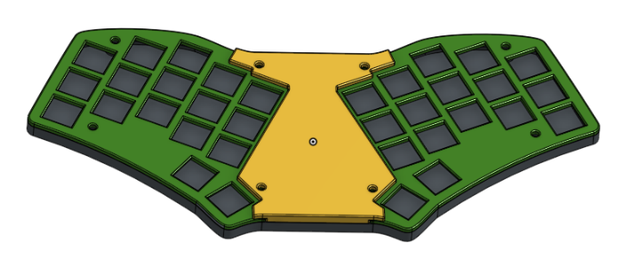
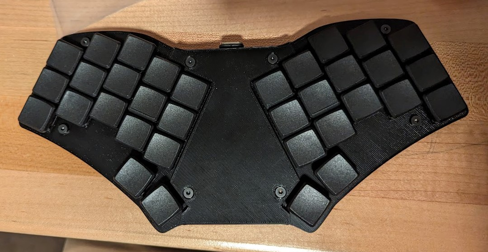
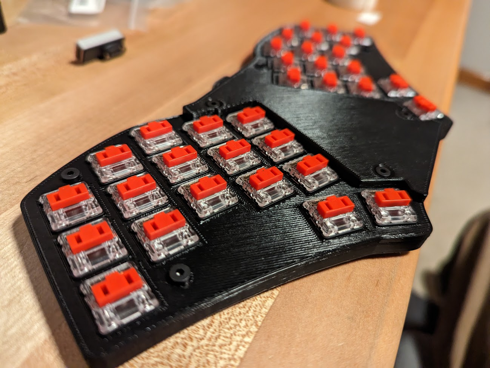
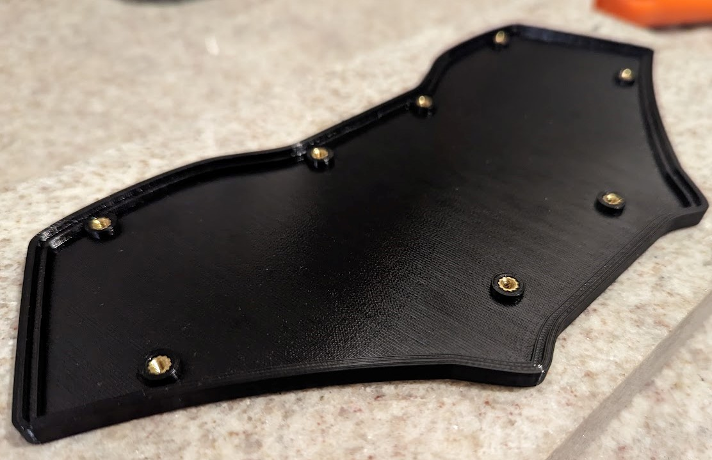
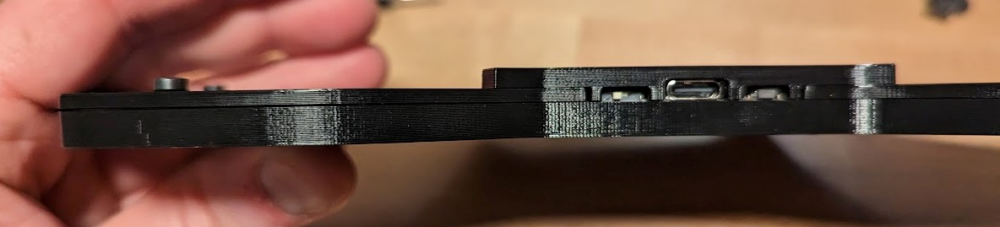

# zaphod_noscreenCase

The file in this repo were used to create a case for the Zaphod keyboard that avoided using the display screen. It was challenging to find the display part available.

The front coves act as a switch plate, which are trapped on once the switches are soldered.

The hardware used were m3 low-profile socket head cap screws. I believe 8mm long.

# Images

